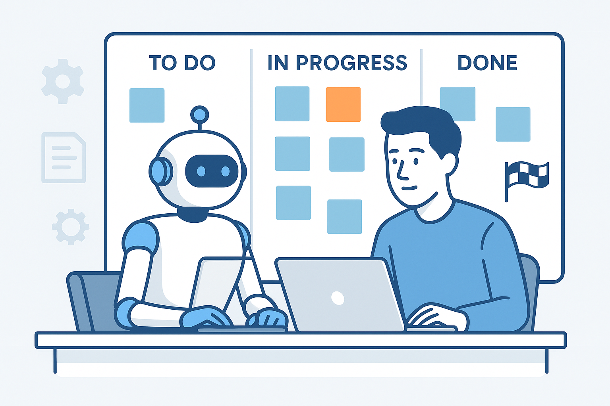

# 🏗️ AI-Assisted Sprint Framework

This framework lets a human user and an AI agent run software development sprints in a **structured, auditable, and predictable** way.

- The **human** defines goals and reviews plans.  
- The **AI agent** generates a detailed Sprint **Playbook** and implements it step by step.  
- The **user** keeps final control over scope and **merging**.

---

## 📑 Files Overview

- **sprint-playbook-template.md** – Markdown structure for defining a Sprint.  
- **how-to-use-sprint-playbook-template.md** – AI-facing guide for generating Playbooks.  
- **sprint-implementation-guidelines.md** – AI-facing rules for execution.  

---

## 🎯 Motivation

Without structure, AI coding agents can:
- Drift from the intended goal  
- Make speculative changes  
- Leave work hard to track/audit

This framework adds **Agile-style discipline**:
- The **Sprint Playbook** = a contract between human and AI  
- The **Guidelines** = strict execution rules  
- The **User** = always in control of merges and scope

---

## 🚀 How to Use

⚠️ **Important**: Before asking the AI to generate or execute a Sprint, always tell it to **read the framework files**:  
- `sprint-playbook-template.md`  
- `how-to-use-sprint-playbook-template.md`  
- `sprint-implementation-guidelines.md`  

This ensures the AI is aligned with the framework rules and structure.

---

### Step 1 — Define the Sprint Goal
Tell the AI what you want at a high level.

**Prompt example**
```

I want this Sprint to add user authentication to my task management app.
Users should be able to register, log in, and log out.

```

---

### Step 2 — Generate the Sprint Playbook
Ask the AI to **read the framework files first**, then create your Sprint Playbook.

**Prompt example**
```

Read the following files before proceeding:

* sprint-playbook-template.md  
* how-to-use-sprint-playbook-template.md

Now, create a Sprint Playbook for the goal I just described.

```

**Revision example**
```

Update the Sprint Playbook:

* Drop logout for now.
* Require password hashing with bcrypt.
* Keep endpoints versioned under /api/v1.

```

---

### Step 3 — Approve the Playbook
Review the generated Playbook carefully:

**✅ Quick Validation Checklist**:
- **Sprint Goal** - Does it match what you requested?
- **User Stories** - Are they small, independent, and testable?
- **Technical Instructions** - Do they match your tech stack?
- **Dependencies** - Are all required libraries/services listed?
- **Definition of Done** - Are AI vs User responsibilities clear?

When satisfied, approve it.

**Prompt example**
```

The Playbook looks good. Approved.
Proceed to execution using the Sprint Implementation Guidelines.

```

---

### Step 4 — Execute the Sprint
Ask the AI to **read the implementation guidelines and your approved Playbook** before starting.

**Prompt example**
```

Read the following files before proceeding:

* sprint-implementation-guidelines.md
* docs/sprints/sprint-08-auth.md   # (the approved Playbook for this Sprint)

Execute the Sprint following the implementation guidelines.

```

**When the AI gets blocked**:

**Prompt example**
```

Show me:
1. The exact error message
2. Which user story is affected  
3. What step failed
4. Current status of all stories

```

---

### Step 5 — Review & Merge
When the AI marks the Sprint as complete:
- Review the Sprint branch and all commits
- Check that the Playbook shows all stories as complete
- Verify the functionality works as expected
- **You** merge the branch into `main`

**Prompt example (final check)**
```

Show me the final Sprint Playbook and the list of commits you created,
in order, with their messages.

```

---

## ✅ Benefits

- **Clarity** — Clear goals and structure for the AI  
- **Traceability** — Playbook + commits = full audit trail  
- **Safety** — AI cannot merge or expand scope without approval  
- **Simplicity** — Markdown + Git; no extra tools needed

---

## 📌 Notes

- Keep Playbooks in `docs/sprints/` for history.  
- The AI **must not** merge or open PRs.  
- Extend this framework with your project’s conventions (linting, CI rules, DoD checklists).  

---

## 📂 Recommended Folder Structure

Use this layout to keep framework files separate from Sprint history:

- `docs/framework/` → Permanent reference files (templates, guides, rules).  
- `docs/sprints/` → All generated Sprint Playbooks (kept for history/audit).  

**Example:**
```plaintext
.
├── README.md                              # Human-facing overview + usage guide
├──docs/
│   ├── framework/                         # The permanent framework
│   │   ├── sprint-playbook-template.md
│   │   ├── how-to-use-sprint-playbook-template.md
│   │   └── sprint-implementation-guidelines.md
│   └── sprints/                           # All actual Sprint Playbooks
│       ├── sprint-01-initial-setup.md
│       ├── sprint-02-refactor-api.md
│       └── sprint-03-authentication.md
```

